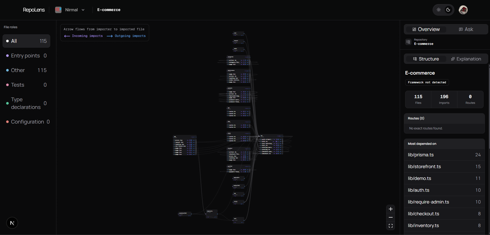

# RepoLens

RepoLens parses public JavaScript and TypeScript repositories and turns their
real imports into an interactive dependency map.

Paste a GitHub URL, explore folders and files, inspect dependencies and blast
radius, and ask questions answered from the parsed repository graph.

> Every node and edge comes from source-code parsing. AI explains the graph; it
> never invents files or relationships.



## Features

- Interactive folder and file dependency map
- Static imports, dynamic imports, re-exports, and CommonJS `require()`
- Incoming and outgoing dependencies, fan-in, fan-out, and blast radius
- Framework-aware file roles and recoverable route detection
- Coverage reporting for skipped files and unresolved imports
- Cached AI explanations for files and folders
- Repository Ask panel backed by six read-only graph tools
- Clerk authentication, organizations, invitations, and admin deletion
- Supabase row-level security and realtime analysis progress
- Light, dark, and system themes with responsive desktop and mobile layouts

RepoLens supports public JavaScript and TypeScript repositories only. It does
not request GitHub repository access or store GitHub tokens.

## Stack

- Next.js 16 App Router and React 19
- TypeScript strict mode and Tailwind CSS 4
- `ts-morph` for source parsing
- React Flow and dagre for graph rendering and layout
- Clerk for authentication and organizations
- Supabase Postgres, RLS, RPCs, and Realtime
- Gemini for classification, explanations, and Ask
- Optional LangSmith tracing
- pnpm and Node.js 22+

## How It Works

```text
Public GitHub repository
        |
        v
Fetch and safely extract archive
        |
        v
Parse files and resolve real imports
        |
        v
Store graph in Supabase
        |
        v
Explore map, details, explanations, and Ask
```

Analysis progresses through four realtime stages: `fetch`, `select`, `parse`,
and `store`.

The parser is standalone and does not import Next.js, React, or database code.
Framework knowledge lives in adapters, and graph calculations are pure
functions over file and edge lists.

## Getting Started

### Requirements

- Node.js `>=22.6.0`
- pnpm `10.32.0`
- Clerk application with Organizations enabled
- Supabase project connected to Clerk
- Gemini API key

### Install

```bash
corepack enable
pnpm install
cp .env.example .env.local
```

Fill in `.env.local`:

```text
NEXT_PUBLIC_CLERK_PUBLISHABLE_KEY=
CLERK_SECRET_KEY=
CLERK_WEBHOOK_SIGNING_SECRET=
NEXT_PUBLIC_CLERK_SIGN_IN_URL=/sign-in
NEXT_PUBLIC_CLERK_SIGN_UP_URL=/sign-up
NEXT_PUBLIC_CLERK_SIGN_IN_FALLBACK_REDIRECT_URL=/
NEXT_PUBLIC_CLERK_SIGN_UP_FALLBACK_REDIRECT_URL=/

NEXT_PUBLIC_SUPABASE_URL=
NEXT_PUBLIC_SUPABASE_PUBLISHABLE_KEY=
SUPABASE_SECRET_KEY=

GEMINI_API_KEY=
REPOLENS_AGENT_CREDENTIAL_SECRET=
LANGSMITH_TRACING=false
```

Generate the rollback credential secret with:

```bash
openssl rand -base64 32
```

Secret values must never use a `NEXT_PUBLIC_` prefix or be committed.

### Configure Services

**Clerk**

1. Enable Organizations.
2. Keep membership optional (`force_organization_selection: false`).
3. Enable automatic organization creation for new users.
4. Keep the default Admin and Member roles.
5. Create a webhook endpoint at `/api/webhooks/clerk` and subscribe only to
   `organization.created`, `organization.updated`, and `organization.deleted`.
6. Put that endpoint's signing secret in `CLERK_WEBHOOK_SIGNING_SECRET`.

**Supabase**

1. Apply every migration in `supabase/migrations/` in timestamp order.
2. Configure Clerk under Authentication > Third-Party Auth.
3. Confirm Clerk tokens receive the Postgres `authenticated` role.
4. Before enabling public sign-up, confirm every existing Clerk organization has
   a matching `public.organizations` row; backfill any missing row once.
5. Confirm RLS is enabled and review the security and performance advisors.

### Run

```bash
pnpm dev
```

Open [http://localhost:3000](http://localhost:3000).

## Commands

| Command | Purpose |
| --- | --- |
| `pnpm dev` | Start the development server |
| `pnpm build` | Create a production build |
| `pnpm start` | Run the production build |
| `pnpm typecheck` | Check TypeScript without emitting files |
| `pnpm lint` | Run ESLint |
| `pnpm parse -- <directory>` | Run the standalone parser |
| `pnpm eval:paths` | Check invented file paths |
| `pnpm eval:roles` | Evaluate role classification |
| `pnpm eval:prompts` | Compare prompt versions |

The parser can also write a typed result:

```bash
pnpm parse -- /path/to/repository --output ./tmp/analysis.ts
```

## Deploy To Vercel

RepoLens is designed to run as one Next.js project on Vercel Hobby. The Ask
assistant runs inside the application, so no LangSmith Agent Server or second
Vercel project is required.

1. Import the repository into Vercel.
2. Select Node.js 22 or newer and keep Fluid Compute enabled.
3. Add all variables from `.env.example` to the Production environment.
4. Keep `LANGSMITH_TRACING=false` for the zero-cost deployment.
5. Apply all Supabase migrations and backfill any existing Clerk organizations.
6. Add the production Vercel domain to Clerk's allowed domains.
7. Configure the production Clerk webhook at
   `https://<your-domain>/api/webhooks/clerk` for only the three organization
   lifecycle events.
8. Deploy only after the checks below pass.

```bash
pnpm typecheck
pnpm lint
pnpm build
```

Do not configure these variables for the embedded production assistant:

```text
REPOLENS_AGENT_URL
LANGSMITH_API_KEY
LANGSMITH_ENDPOINT
LANGSMITH_PROJECT
GOOGLE_API_KEY
```

## Deployment Limits

These limits are deliberate and must not be hidden by reducing parser coverage:

- Vercel Hobby may terminate analysis after 300 seconds.
- Repository archives use temporary storage and are deleted after analysis.
- Maximum compressed archive size: 50 MB.
- Maximum extracted content: 250 MB.
- Maximum archive entries: 20,000.
- GitHub requests time out after 120 seconds.
- Supabase, Clerk, Gemini, and Vercel free-tier quotas still apply.
- Supabase free projects may pause after inactivity.
- Gemini quota exhaustion stops uncached AI features, but stored maps and graph
  calculations remain available.

Large repositories that exceed these boundaries fail with a stated reason.
RepoLens does not use a queue, worker, container, or second deployed service.

## Project Rules

- Never create a dependency edge unless the parser resolves it to a real file.
- Report skipped and unresolved items instead of guessing.
- Keep framework checks outside the standalone parser.
- Keep graph calculations pure.
- Enforce organization access through Supabase RLS.
- Construct AI clients in one shared server-only location.
- Do not score or grade repositories; RepoLens explains structure.

## Documentation

- [`docs/project-doc.md`](docs/project-doc.md): product decisions and reasoning
- [`docs/deployment.md`](docs/deployment.md): production migration and rollback
- [`docs/zero-cost-deployment-plan.md`](docs/zero-cost-deployment-plan.md): Vercel architecture and acceptance checks
- [`docs/specs/`](docs/specs): phase specifications
- [`AGENTS.md`](AGENTS.md): engineering rules for this repository
